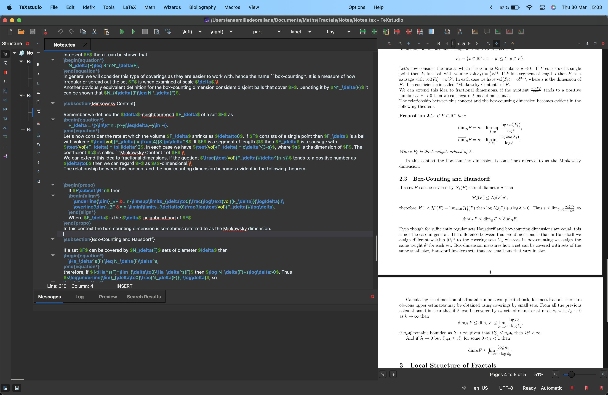
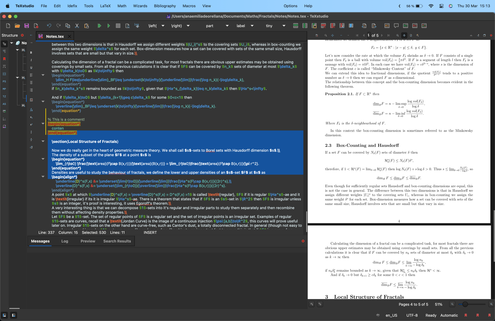

# My [TeXstudio](https://texstudio.org/) theme

This repo is for me, for faster configuring my texstudio appereance in future setups.

## How to Install via copying text to file

1. Download the latest release.
2. Set up the dark IDE.
3. Restart TeXstudio
4. Open TeXstudio.
5. Export your actual profile (same procedure as backup).
64. Open your *.txsprofile file on any text editor.
7. Find the "[formats]" string or "[formatsdark]" string if applies.
8. Copy the content from "Dark-TeXstudio.txt" under the "[formats]"/"[formatsdark]" string, if it there is any text under overwrite it.
9. Save the file.
10. Go to menu bar -> Click in `Options`  -> Click on `Load Profile...` and select the file your *.txsprofile file.
11. Restart TeXstudio.
12. Enjoy!

## How to Install via *.txsprofile file

This method could overwrite your shortcuts, recommended if you have not tweaked any configuration.

1. Download the latest release.
2. Open TeXstudio.
3. Go to menu bar -> Click in `Options`  -> Click on `Load Profile...` and select the file "MyTheme.txsprofile".
4. Restart TeXstudio.
5. Enjoy!

## Colours

- background `#131313` 
- keyword `#FF5E2B` 
- structure `#00AAFF` 
- comment `#8FAE90` 
- text `#E9E9E9` 
- background `#131313` 
- keyword `#FF5E2B` 
- extra-keyword `#537E9A` 
- environment `#C69500` 
- structure `#00AAFF` 
- comment `#8FAE90` 
- math-delimiter `#399900` 
- math-keyword `#268BD2` 
- number `#33C7BB` 
- align-ampersand `#DC322F` 
- text `#E9E9E9` 
- background `#131313` 
- keyword `#FF5E2B` 
- extra-keyword `#537E9A` 
- environment `#C69500` 
- structure `#00AAFF` 
- comment `#8FAE90` 
- math-delimiter `#399900` 
- math-keyword `#268BD2` 
- number `#33C7BB` 
- align-ampersand `#DC322F` 
- text `#E9E9E9` 
- background `#131313` 
- keyword `#FF5E2B` 
- extra-keyword `#537E9A` 
- environment `#C69500` 
- structure `#00AAFF` 
- referencePresent `#D70170` 
- referenceMissing `#FF859E` 
- referenceMultiple `#734967` 
- text `#E9E9E9` 
- line:error   &nbsp;&nbsp;&nbsp;&nbsp;&nbsp;-> from `#FFC9BF`  to `#FF8269` 
- line:warning -> from `#FFFABF`  to `#FFF569` 
- line:badbox  &nbsp;-> from `#BFD6FF`  to `#69A0FF` 
- replacement  -> from `#FFDEDE`  to `#FF6969` 

## How it looks

